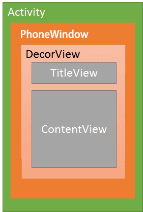

# 【六】Activity 与 Window、PhoneWindow、DecorView 之间的关系



* ### Activity与Window

```java
public class Activity extends ContextThemeWrappe{ 
    private Window mWindow;
}
每一个 Activity 都持有一个 Window 对象。
```

* ### Window与PhoneWidow

```java
public class PhoneWindow extends Window{
    // This is the top-level view of the window, containing the window decor. 
    private DecorView mDecor; 
}
但是 Window 是一个抽象类，这里 Android 为 Window 提供了唯一的实现类 PhoneWindow。也就是说 Activity 中的 window 实例就是一个 PhoneWindow 对象。
```

* ### PhoneWindow与DecoreView

```java
如上代码： PhoneWindow 中持有一个 Android 中非常重要的一个 View 对象 Decor(装饰)View；
public class DecorView extends FrameLayout { 
}
查看 DecorView 继承关系得知，DecorView 继承自 FrameLayout。
```

现在的关系就很明确了，每一个 Activity 持有一个 PhoneWindow 的对象，而一个 PhoneWindow 对象持有一个 DecorView 的实例，所以 Activity 中 View 相关的操作其实大都是通过 DecorView 来完成。

* ### setContentView和DecorView

```java
Activity.setContentView():
public void setContentView(@LayoutRes int layoutResID) { 
    getWindow().setContentView(layoutResID); 
    initWindowDecorActionBar();
}
Activity 的 setContentView 方法紧接着又调用的 Window setContentView 方法，从上面的描述可知，这里的 window 其实就是 PhoneWindow，所以查看 PhoneWindow 的 setContentView 方法实现。
PhoneWindow.setContentView():
@Override 
public void setContentView(int layoutResID) { 
    if (mContentParent == null) { 
        //初始化 id 为 android.R.id.content 的根布局，将其赋值给 mContentParent 
        installDecor(); 
    } else {
        mContentParent.removeAllViews();
    } //把 Activity 中指定的布局 id 最终 inflate 到 mContentParent 中 
    mLayoutInflater.inflate(layoutResID, mContentParent); 
    final Callback cb = getCallback(); 
    if (cb != null && !isDestroyed()) {
         cb.onContentChanged(); 
    }
}
这个方法就是最终发生作用的地方，执行完该方法后，从 Activity 传递而来的布局资源 id 最终就会添加到 decorView 中。这里的 installDecor 方法很重要
```

```java
DecorView是一个FrameLayout，然后会根据theme去选择系统中的布局文件，将布局文件通过inflate转化为view，加入到DecorView中；
这些布局文件中都包含一个id为content的FrameLayout，将其引用返回给mContentParent。有了mContentParent，然后把我们写的布局文件通过inflater加入到mContentParent中。
关于android.R.id.content也可以直观的看到。
比如R.layout.xxx可以在frameworks\base\core\res\res\layout里面进行查看，比如R.layout.screen_custom_title.xml：
<LinearLayout xmlns:android="http://schemas.android.com/apk/res/android” 
                android:orientation="vertical” 
                android:fitsSystemWindows="true”> 
<!-- Popout bar for action modes —> 
    <ViewStub android:id="@+id/action_mode_bar_stub” 
        android:inflatedId="@+id/action_mode_bar” 
        android:layout="@layout/action_mode_bar” 
        android:layout_width="match_parent” 
        android:layout_height="wrap_content" />
    <FrameLayout android:id="@android:id/title_container” 
        android:layout_width="match_parent” 
        android:layout_height="?android:attr/windowTitleSize”
        style="?android:attr/windowTitleBackgroundStyle”> 
    </FrameLayout> 
    <FrameLayout 
        android:id="@android:id/content” 
        android:layout_width="match_parent” 
        android:layout_height="0dip” 
        android:layout_weight="1” 
        android:foregroundGravity="fill_horizontal|top” 
        android:foreground="?android:attr/windowContentOverlay" />
 </LinearLayout>
```

* ### 事件分发与DecorView

```java
Activity 在接受到上层派发来的事件后，会把事件传递到自己的 dispatchTouchEvent 方法中，然后Activity 会把触摸、点击事件传递给自己的 mWindow 对象，最终传递给 decorView 的 dispatchTouchEvent 方法。
Activity.dispatchTouchEvent:
public boolean dispatchTouchEvent(MotionEvent ev) {
    if (ev.getAction() == MotionEvent.ACTION_DOWN) {
     //不关心 
    onUserInteraction(); 
    } //派发给 window 对象 
    if (getWindow().superDispatchTouchEvent(ev)) { 
        return true; 
    } 
    return onTouchEvent(ev);
}
PhoneWindow.dispatchTouchEvent:
@Override
public boolean superDispatchTouchEvent(MotionEvent event) {
    return mDecor.superDispatchTouchEvent(event);
}
最终的事件传递到了decorView，看 decorView 怎么处理事件
DecorView.dispatchTouchEvent:
public boolean superDispatchTouchEvent(MotionEvent event) { 
    return super.dispatchTouchEvent(event);
}
可以看到 DecorView 直接调用了 super 的 dispatchTouchEvent方法，也就是最终走了 ViewGroup 的 dispatchTouchEvent 方法。
```

