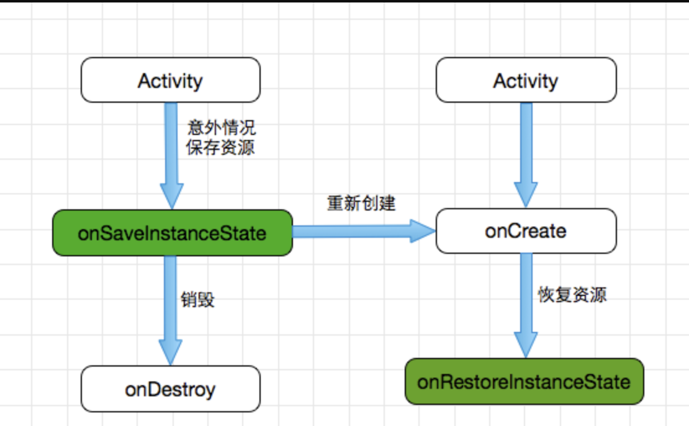

# 【二】Activity异常生命周期

> Tips:
>
> ​    异常的生命周期是指Activity被系统回收或者当前设备的Configuration发生变化（一般指横竖屏切换）从而导致Activity被销毁重建。异常的生命周期主要分以下两种情况：
>
> ​    1、系统配置发生改变导致Activity被杀死并重新创建（一般指横竖屏切换）
>
> ​    2、内存不足导致低优先级的Activity被杀死

* ### 系统配置改变导致Activity被杀死

当我们正常启动Activity时，onCreate，onStart，onResume方法都会依次被回调；

而如果我们此时把竖屏的Activity人为的调整为横屏，我们可以发现onPause，onSaveInstanceState，onStop，onDestroy，onCreate，onStart，onRestoreInstanceState，onResume依次被调用，单从调用的方法我们就可以知道，Activity先被销毁后再重新创建。

* ### 异常生命周期

* ### onSaveInstanceState和onRestoreInstanceState

这两个方法是系统自动调用的，当系统配置发生变化后，Activity会被销毁，也就是onPause，onStop，onDestroy会被依次调用，同时因为Activity是在异常情况下销毁的，android系统会自动调用onSaveInstanceState方法来保存当前Activity的状态信息，因此我们可以在onSaveInstanceState方法中存储一些数据以便Activity重建之后可以恢复这些数据，当然这个方法的调用时机必须在onStop方法之前，也就是Activity停止之前。至跟onPause方法的调用时机可以随意。而通过前面的Log信息我们也可以知道当Activity被重新创建之后，系统还会去调用onRestoreInstanceState方法，并把Activity销毁时通过onSaveInstanceState方法保存的Bundle对象作为参数同时传递给onRestoreInstanceState和onCreate方法，因此我们可以通过onRestoreInstanceState和onCreate方法来判断Activity是否被重新创建，倘若被重建了，我们就可以对之前的数据进行恢复。从Log信息，我们可以看出onRestoreInstanceState方法的调用时机是在onStart之后的。这里有点需要特别注意，onSaveInstanceState和onRestoreInstanceState只有在Activity异常终止时才会被调用的，正常情况是不会调用这两个方法的。

  到这里大家可能还有一个疑问，onRestoreInstanceState和onCreate方法都可以进行数据恢复，那到底用哪个啊?其实两者都可以，两者的区别在于，onRestoreInstanceState方法一旦被系统回调，其参数Bundle一定不为空，无需额外的判断，而onCreate的Bundle却不一定有值，因为如果Activity是正常启动的话，Bundle参数是不会有值的，因此我们需要额外的判断条件，当然虽说两者都可以数据恢复，但更倾向于**onRestoreInstanceState**方法。

  最后还有点我们要知道的是，在onSaveInstanceState方法和onRestoreInstanceState方法中，android系统会自动帮我们恢复一定的数据，如当前Activity的视图结构，文本框的数据，ListView的滚动位置等，这些View相关的状态系统都会帮我们恢复，这是因为每个View也有onSaveInstanceState方法和onRestoreInstanceState方法。每个View都有onSaveInstanceState和onRestoreInstanceState这两个方法，看一下它们的具体实现，就能知道系统能够自动为每个View恢复哪些数据。

* ### View保存和恢复工作流程

首先Activity被意外终止时，Activity会调用onSaveInstanceState去保存数据，然后Activity会委托Window去保存数据，接着Window再委托它上面的顶级容器去保存数据。顶层容器是一个ViewGroup，一般来说它很可能是DecorView。最后顶层容器再去一一通知它的子元素来保存数据，这样整个数据保存过程就完成了。至于数据恢复过程也是类似的。

* ### 内存不足导致优先级低的Activity被杀死

资源内存不足，导致优先级低的Activity被杀死，Activity按照优先级从高到低，可以分为如下三种：

​    1）前台Activity-----正在和用户交互的Activity，优先级最高；

​    2）可见但非前台Activity-----比如Activity中弹出了一个对话框，导致Activity可见但是位于后台无法和用户直接交互；

​    3）后台Activity-----已经被暂停的Activity，比如执行了onStop，优先级最低；

* ### 系统配置变化后，希望不重建Activity

当系统配置发生改变后，Activity会被重新创建，如果我们不想系统重新创建Activity，可以给Activity指定configChanges属性。我们常用的只有locale、orientation和keyboardHidden这三个选项。当使用这些配置时，Activity不会重新创建，也不会调用onSaveInstanceState和onRestoreInstanceState来存储和恢复数据，取而代之的是系统调用了Activity的onConfigurationChanged方法，这个时候我们就可以做一些自己的特殊处理了。

