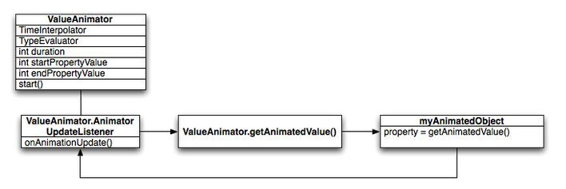

# 【三】属性动画

属性动画，是补间动画的增强版，但更加灵活。可直接修改任何属性，使之形成动画，功能非常强大，也是最常用的动画。 属性动画自定义如下属性：

- 动画时间（Duration）：指定动画总共完成所需要的时间，默认为300ms;
- 时间插值器（Time interpolation）： 是一个基于当前动画已消耗时间的函数，用来计算属性的值；
- 重复次数（Repeat count）：指定动画是否重复执行，重复执行的次数，也可以指定动画向反方向地回退操作；
- 动画集（Animator sets）：将一系列动画放进一个组，可以设置同时执行或者按序执行；
- 延迟刷新时间（Frame refresh delay）：指定动画刷新的频率，默认为每10ms刷新一帧，但应用程序的帧的刷新频率最终取决于整个系统的忙闲程序与系统的时钟频率。

### 属性动画类



上图描述了属性动画在绘制动画过程的相关类：

- ValueAnimator：记录动画的运行时间，位移，当前将要绘制的属性
- TimeInterpolator：时间插值器，用于根据随着时间的变化来计算当前属性变化的百分比
- TypeEvaluator：估值器，用于根据属性改变的百分比来计算改变后的属性值

属性动画设置好起始值和结束值，执行总时间等参数。当调用start()动画开始， 在整个动画期间，ValueAnimator计算已绘制的时间比(elapsed fraction)，区间[0,1]，代表动画的完成率。动画运行过程中，通过调用onAnimationUpdate方法来更新画面，getAnimatedValue()获取当前动画的property。

1. **ValueAnimator**

Animator类提供了关于创造动画的一系列基本的结构，是一个抽象类。ValueAnimator是整个属性动画框架的核心类，使用方法如下：

```java
ValueAnimator valueAnim = ValueAnimator.ofFloat(0f, 1f);
valueAnim.setDuration(250);
fadeAnim.start();
```

再通过动画的`AnimatorUpdateListener`获取动画每一帧的返回值，如果有需要还可以增加`AnimatorListenerAdapter`来指定动画开始、结束、取消、重复等事件发生时的处理方法。

```java
valueAnim.addUpdateListener(new AnimatorUpdateListener() {
    @Override
        public void onAnimationUpdate(ValueAnimator animation) {
        int frameValue = (Integer)animation.getAnimatedValue();
        //根据frameValue指定相应的透明度，位移，旋转，缩放等相应的动画
        balls.setAlpha(frameValue);

    }
});

valueAnim.addListener(new AnimatorListenerAdapter() {
    public void onAnimationEnd(Animator animation) {
        //当动画结束时移除相应对象
        balls.remove(((ObjectAnimator)animation).getTarget());
    }
});
```

2. **ObjectAnimator**

对象动画，继承`ValueAnimator`, 允许指定`target object`，并且`target object`需要有setter方法。

```java
ObjectAnimator anim = ObjectAnimator.ofFloat(targetObject, "alpha", 0f, 1f);
anim.setDuration(1000);
anim.start();
```

3. **AnimatorSet**

动画的集合，用于组合一系列动画。

```java
AnimatorSet  animatorSet = new AnimatorSet();
animatorSet.play(bounceAnim).before(squashAnim1);
animatorSet.play(squashAnim1).with(squashAnim2);
animatorSet.play(bounceBackAnim).after(stretchAnim2);
animatorSet.start();
```

### 代码实现

```java
// 属性动画，不需资源文件
ObjectAnimator anim = ObjectAnimator.ofFloat(targetObject, "alpha", 0f, 1f);
anim.setDuration(1000);
anim.start();
```

### 插值器（Interpolators）

时间插值器，定义了一个时间的映射关系，可能为如下的插值器：

| 插值器                           | 描述                               |
| :------------------------------- | :--------------------------------- |
| LinearInterpolator               | 线性插值                           |
| AccelerateInterpolator           | 加速                               |
| DecelerateInterpolator           | 减速                               |
| AccelerateDecelerateInterpolator | 先加速，后减速                     |
| AnticipateInterpolator           | 先向后，再向前抛向终点             |
| OvershootInterpolator            | 向前抛出终点，再回到终点           |
| AnticipateOvershootInterpolator  | 先向后，再向前抛出终点，再回到终点 |
| BounceInterpolator               | 结束时反弹                         |
| CycleInterpolator                | 循环播放                           |
| TimeInterpolator                 | 用于自定义                         |

所有插值器都实现了TimeInterpolator接口，需要自定义插值器，只需实现如下接口：

```java
public interface TimeInterpolator {

    /* * @param input 代表动画的已执行的时间，∈[0,1] * @return 插值转换后的值 */
    float getInterpolation(float input);
}
```

### 估值器（Evaluators）

估值器，用于计算属性动画的给定属性的取值。与属性的起始值，结束值，`fraction`三个值相关。

| 估值器         | 描述                             |
| :------------- | :------------------------------- |
| IntEvaluator   | 用于评估int型的属性值            |
| FloatEvaluator | 用于评估float型的属性值          |
| ArgbEvaluator  | 用于评估颜色的属性值，采用16进制 |
| TypeEvaluator  | 用于自定义估值器的接口           |

所有的估值器都实现了TypeEvaluator接口，自定义估值器，只需实现如下接口：

```java
public interface TypeEvaluator<T> {
    /* * * @param fraction 插值器计算转换后的值 * @param startValue 属性起始值 * @param endValue 属性结束值 * @return 转换后的值 */
    public T evaluate(float fraction, T startValue, T endValue);
}
```

