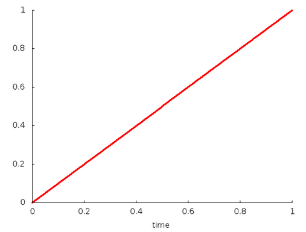
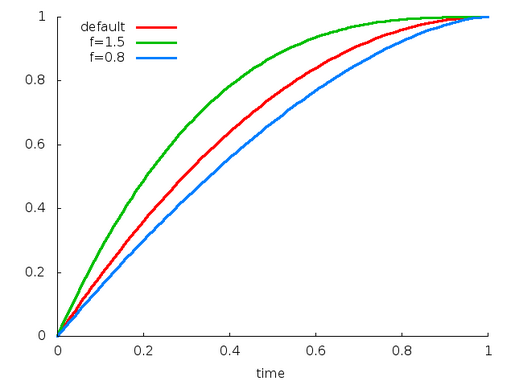
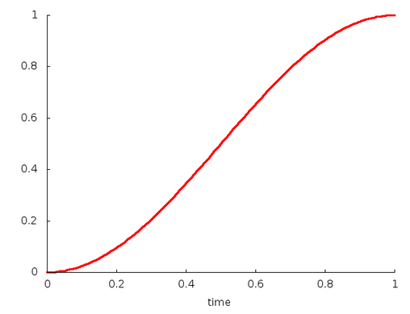
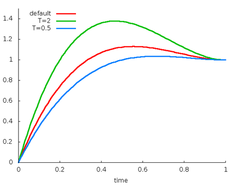
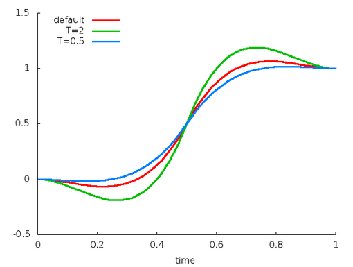
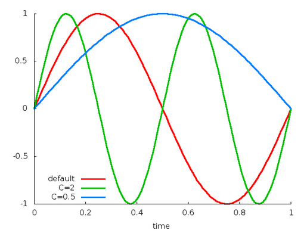

# 【四】插值器

### 差值器概述

* 线性插值的动画

图1是在屏幕上进行水平位移的动画，总时间是40ms，移动总距离为40pixels(像素)，每10ms刷新一帧，同时移动10pixels。在第40ms动画结束，停止在水平位置40pixels的位置。整个动画过程采用的是线程插值器（ linear interpolation），意味着以匀速移动。


* 非线性插值的动画

当然，也可以指定差值器是非线性的，图2采用的是先加速，再减速的差值器。同样是在40ms内移动40pixels。在开始的时候，动画一直加速到一半的距离（20pixels）,然后在减速剩下的一半距离直到动画结束。从图2可以看出，动画的两头的位移量低于中间部门的位移量。


### 插值器

时间插值器，定义了一个时间的函数：y = f(t),其中t=`elapsed time` / `duration`.

每个插值器的源码流程都相同，下面以AccelerateInterpolator为例，说明插值器的内部原理：

```java
//系统自带的所有插值器都继承了BaseInterpolator
public class AccelerateInterpolator extends BaseInterpolator implements NativeInterpolatorFactory {
    private final float mFactor;
    private final double mDoubleFactor;

    //无参数的构造方法, factor默认为1
    public AccelerateInterpolator() {
        mFactor = 1.0f;
        mDoubleFactor = 2.0;
    }

    //有参数的构造方法
    public AccelerateInterpolator(float factor) {
        mFactor = factor;
        mDoubleFactor = 2 * mFactor;
    }

     //构造方法，通过资源文件获取参数
    public AccelerateInterpolator(Context context, AttributeSet attrs) {
        this(context.getResources(), context.getTheme(), attrs);
    }

    /** @hide 隐藏方法，真正用来解析资源文件的方法*/
    public AccelerateInterpolator(Resources res, Theme theme, AttributeSet attrs) {
        TypedArray a;
        if (theme != null) {
            a = theme.obtainStyledAttributes(attrs, R.styleable.AccelerateInterpolator, 0, 0);
        } else {
            a = res.obtainAttributes(attrs, R.styleable.AccelerateInterpolator);
        }

        //资源文件未定义factor时，默认为1.0f
        mFactor = a.getFloat(R.styleable.AccelerateInterpolator_factor, 1.0f);
        mDoubleFactor = 2 * mFactor;
        setChangingConfiguration(a.getChangingConfigurations());
        // 回收TypedArray，释放相应的内存资源
        a.recycle();
    }

    //插值计算的核心方法，定义了插值的映射关系
    public float getInterpolation(float input) {
        if (mFactor == 1.0f) {
            return input * input;
        } else {
            return (float)Math.pow(input, mDoubleFactor);
        }
    }

    /** @hide */
    @Override
    public long createNativeInterpolator() {
        return NativeInterpolatorFactoryHelper.createAccelerateInterpolator(mFactor);
    }
}
```

其中 `BaseInterpolaor`实现了`Interpolator`接口，而`Interpolator`接口并没有定义任何方法和属性，只是单纯地继承了`TimeInterpolator`

```java
abstract public class BaseInterpolator implements Interpolator {
    private int mChangingConfiguration;
    /** * @hide */
    public int getChangingConfiguration() {
        return mChangingConfiguration;
    }

    /** * @hide */
    void setChangingConfiguration(int changingConfiguration) {
        mChangingConfiguration = changingConfiguration;
    }
}
```

`TimeInterpolator`接口自定义了一个方法`getInterpolation`,这就是所有插值器最为核心的方法。

```java
public interface TimeInterpolator {

    /* * @param input 代表动画的已执行的时间，∈[0,1] * @return 插值转换后的值 */
    float getInterpolation(float input);
}
```

通过分析每一个插值器的插值方法的源码，下面总结了所有插值器的插值函数：

#### 1. Linear

- 资源ID: @android:anim/linear_interpolator
- 构造方法：
  - `public LinearInterpolator()`; //没有任何可调参数
- 插值函数：
  - 公式：`y=t`
- 插值曲线：



#### 2. Accelerate

- 资源ID: @android:anim/accelerate_interpolator
- 构造方法：
  - `public AccelerateInterpolator()`；//默认factor=1
  - `public AccelerateInterpolator(float factor)`；
  - `public AccelerateInterpolator(Context context, AttributeSet attrs)`; //通过资源文件获取factor值，默认为1。
- 插值函数：factor为加速因子，记为f, 默认值为1
  - 公式：`y=t^(2f)`
  - 缺省：`y=t^2`
- 插值曲线：


#### 3. Decelerate

- 资源ID: @android:anim/decelerate_interpolator
- 构造方法：
  - `public AccelerateInterpolator()`；//默认factor=1
  - `public AccelerateInterpolator(float factor)`；
  - `public AccelerateInterpolator(Context context, AttributeSet attrs)`; //通过资源文件获取factor值，默认为1。
- 插值函数：factor为减速因子，记为f, 默认值为1
  - 公式：`y= 1-(1-t）^(2f)`,
  - 缺省：`y= 2t-t^2`
- 插值曲线：



#### 4. AccelerateDecelerate

- 资源ID: @android:anim/accelerate_decelerate_interpolator
- 构造方法：
  - `public AccelerateDecelerateInterpolator()`； //没有任何可调参数 资源文件获取factor值。
- 插值函数：
  - 公式：`y = 0.5cos((t+1)π)+0.5`
- 插值曲线：



#### 5. Anticipate

- 资源ID: @android:anim/anticipate_interpolator
- 构造方法：
  - `public AnticipateInterpolator()`；//默认tension=2
  - `public AnticipateInterpolator(float tension)`；
  - `public AnticipateInterpolator(Context context, AttributeSet attrs)`; //通过资源文件获取tension值。
- 插值函数：tension`为张力因子，记为s, 默认值为2
  - 公式：`y = t*t*((s+1)t-s)`,
  - 缺省：`y = t*t*(3t-2)`
- 插值曲线：


#### 6. Overshoot

- 资源ID: @android:anim/overshoot_interpolator
- 构造方法：
  - `public OvershootInterpolator()`；//默认tension=2
  - `public OvershootInterpolator(float tension)`；
  - `public OvershootInterpolator(Context context, AttributeSet attrs)`; //通过资源文件获取tension值。
- 插值函数：tension`为张力因子，记为s, 默认值为2
  - 公式：`y = (t-1)(t-1)((s+1)(t-1)+s) + 1`,
  - 缺省：`y = (t-1)(t-1)(3t-1) + 1`
- 插值曲线：



#### 7. AnticipateOvershoot

- 资源ID: @android:anim/anticipate_overshoot_interpolator
- 构造方法：
  - `public AnticipateOvershootInterpolator()`；//默认tension=3
  - `public AnticipateOvershootInterpolator(float tension)`； //tension = 1.5*tension
  - `public AnticipateOvershootInterpolator(float tension, float extraTension)`; //tension = tension * extraTension
  - `public AnticipateOvershootInterpolator(Context context, AttributeSet attrs)`; //通过资源文件获取tension值。
- 插值函数：tension`为张力因子，记为s
  - 公式：
    - `y = 2t*t*(2t*s+2t-s), 当t < 0.5时`,
    - `y = 2(t-1)(t-1)(2(s+1)(t-1)+s) + 1 , 当t >= 0.5时`,
  - 缺省：
    - `y = 2t*t*(8t-3), 当t < 0.5时`,
    - `y = 2(t-1)(t-1)(8t-5) + 1 , 当t >= 0.5时`,
- 插值曲线：



#### 8. Bounce

- 资源ID: @android:anim/bounce_interpolator
- 构造方法：
  - `public BounceInterpolator()`；//没有任何可调参数
- 插值函数：
  - 公式：
    - y = 8*(1.1226t)^2 ，当 t < 0.3535
    - y = 8*(1.1226t - 0.54719)^2 + 0.7 ，当 t < 0.7408
    - y = 8*(1.1226t - 0.8526)^2 + 0.9 ，当 t < 0.9644
    - y = 8*(1.1226t - 1.0435)^2 + 0.95 ，当 t <= 1.0
- 插值曲线：


#### 9. Cycle

- 资源ID: @android:anim/cycle_interpolator
- 构造方法：
  - `public CycleInterpolator(float cycles)`；
  - `public CycleInterpolator(Context context, AttributeSet attrs)`; //通过资源文件获取cycles值，默认为1。
- 插值函数：cycles`为循环次数，记为c
  - 公式：`y = sin（2*c*t*π）`,
  - 缺省：`y = sin（2*t*π）`
- 插值曲线：

