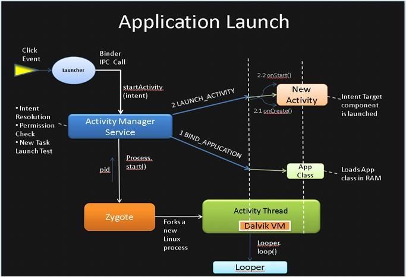

# 【七】Application启动流程

### 整体流程

1. Launcher通知AMS启动APP的Activity，也就是清单文件设置启动的Activity。
2. AMS记录要启动的Activity信息，并且通知Launcher进入pause状态。
3. Launcher进入pause状态后，通知AMS已经paused了，可以启动App了。
4. App未开启过，所以AMS启动新的进程，并且在新进程中创建ActivityThread对象，执行其中的main函数方法。
5. App主线程启动完毕后通知AMS，并传入applicationThread以便通讯。
6. AMS通知绑定Application并启动Activity。
7. 启动MainActivitiy，并且创建和关联Context,最后调用onCreate方法。

### 详细说明

1. Launcher的Click事件会调用startActivity(Intent), 通过Binder IPC机制, 最终调用到ActivityManagerService；

2. AMS会调用Process.start()，通过socket通道传递参数到Zygote进程， Zygote孵化自身（fork）, 并调用ZygoteInit.main()方法来实例化ActivityThread对象并最终返回新进程的pid；

3. ActivityThread是每个app的入口类，ActivityThread随后依次调用Looper.prepareLoop()和Looper.loop()来开启消息循环；

4. ActivityThread创建完成后，会调用bindApplication方法，将创建的进程和Application绑定，此时会创建Application并执行生命周期；

5. Application创建完成后，会启动Activity，会执行它的生命周期；

6. Activity生命周期执行结束会，会进入ViewRootImpl，它才是真正的界面绘制；