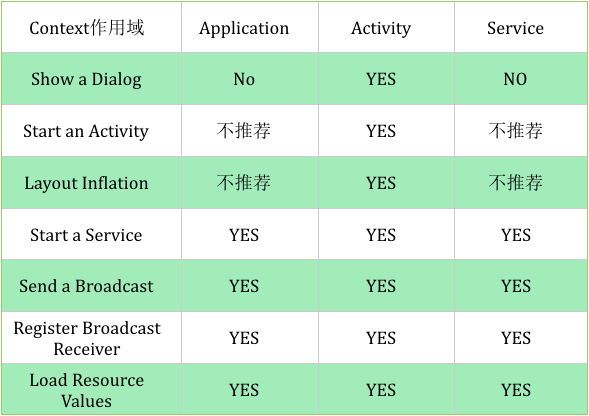

# 【三】Context作用

* ### Context能干什么

```java
这个就实在是太多了，弹出Toast、启动Activity、启动Service、发送广播、操作数据库等等都需要用到Context。
TextView tv = new TextView(getContext());
ListAdapter adapter = new SimpleCursorAdapter(getApplicationContext(), …);
AudioManager am = (AudioManager) getContext().getSystemService(Context.AUDIO_SERVICE);
getApplicationContext().getSharedPreferences(name, mode); 
getApplicationContext().getContentResolver().query(uri, ...); 
getContext().getResources().getDisplayMetrics().widthPixels * 5 / 8;
getContext().startActivity(intent); getContext().startService(intent); 
getContext().sendBroadcast(intent);
```

* ### Context作用域

虽然Context神通广大，但并不是随便拿到一个Context实例就可以为所欲为，它的使用还是有一些规则限制的。

由于Context的具体实例是由ContextImpl类去实现的，因此在绝大多数场景下，Activity、Service和Application这三种类型的Context都是可以通用的。

不过有几种场景比较特殊，比如启动Activity，还有弹出Dialog。出于安全原因的考虑，Android是不允许Activity或Dialog凭空出现的，一个Activity的启动必须要建立在另一个Activity的基础之上，也就是以此形成的返回栈。而Dialog则必须在一个Activity上面弹出（除非是System Alert类型的Dialog），因此在这种场景下，我们只能使用Activity类型的Context，否则将会出错。



* ### Context限制

从上图我们可以发现Activity所持有的Context的作用域最广，无所不能

因为Activity继承自ContextThemeWrapper，而Application和Service继承自ContextWrapper，很显然ContextThemeWrapper在ContextWrapper的基础上又做了一些操作使得Activity变得更强大，这里我就不再贴源码给大家分析了，有兴趣的童鞋可以自己查查源码。上图中的YES和NO我也不再做过多的解释了，这里我说一下上图中Application和Service所不推荐的两种使用情况。

1：如果我们用ApplicationContext去启动一个LaunchMode为standard的Activity的时候会报错android.util.AndroidRuntimeException: Calling startActivity from outside of an Activity context requires the FLAG_ACTIVITY_NEW_TASK flag. Is this really what you want?这是因为非Activity类型的Context并没有所谓的任务栈，所以待启动的Activity就找不到栈了。解决这个问题的方法就是为待启动的Activity指定FLAG_ACTIVITY_NEW_TASK标记位，这样启动的时候就为它创建一个新的任务栈，而此时Activity是以singleTask模式启动的。所有这种用Application启动Activity的方式不推荐使用，Service同Application。

2：在Application和Service中去layout inflate也是合法的，但是会使用系统默认的主题样式，如果你自定义了某些样式可能不会被使用。所以这种方式也不推荐使用。

一句话总结：凡是跟UI相关的，都应该使用Activity做为Context来处理；其他的一些操作，Service,Activity,Application等实例都可以，当然了，注意Context引用的持有，防止内存泄漏。