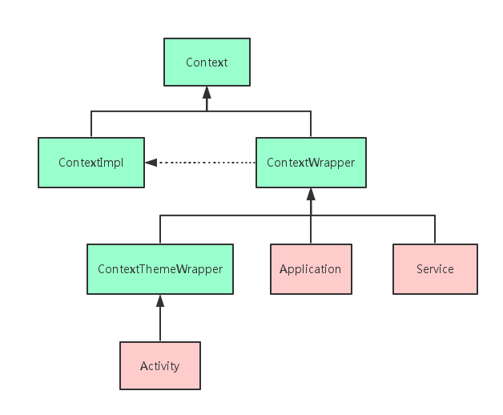

# 【二】Context分类

* ### Context分类继承

Context提供了关于应用环境全局信息的接口。它是一个抽象类，它的执行被Android系统所提供。它允许获取以应用为特征的资源和类型，是一个统领一些资源（应用程序环境变量等）的上下文。就是说，它描述一个应用程序环境的信息（即上下文）；是一个抽象类，Android提供了该抽象类的具体实现类；通过它我们可以获取应用程序的资源和类（包括应用级别操作，如启动Activity，发广播，接受Intent等）。既然上面Context是一个抽象类，那么肯定有他的实现类咯，我们在Context的源码中通过IDE可以查看到他的子类最终可以得到如下关系图：

> Context类本身是一个纯abstract类，它有两个具体的实现子类：ContextImpl和ContextWrapper。
>
> 其中ContextWrapper类，如其名所言，这只是一个包装而已，ContextWrapper构造函数中必须包含一个真正的Context引用，同时ContextWrapper中提供了attachBaseContext（）用于给ContextWrapper对象中指定真正的Context对象，调用ContextWrapper的方法都会被转向其所包含的真正的Context对象。ContextThemeWrapper类，如其名所言，其内部包含了与主题（Theme）相关的接口，这里所说的主题就是指在AndroidManifest.xml中通过android：theme为Application元素或者Activity元素指定的主题。当然，只有Activity才需要主题，Service是不需要主题的，因为Service是没有界面的后台场景，所以Service直接继承于ContextWrapper，Application同理。而ContextImpl类则真正实现了Context中的所以函数，应用程序中所调用的各种Context类的方法，其实现均来自于该类。一句话总结：Context的两个子类分工明确，其中ContextImpl是Context的具体实现类，ContextWrapper是Context的包装类。Activity，Application，Service虽都继承自ContextWrapper（Activity继承自ContextWrapper的子类ContextThemeWrapper），但它们初始化的过程中都会创建ContextImpl对象，由ContextImpl实现Context中的方法。

* ### 应用程序有多少个Context

在应用程序中Context的具体实现子类就是：Activity，Service，Application。那么Context数量=Activity数量+Service数量+1。当然如果你足够细心，可能会有疑问：我们常说四大组件，这里怎么只有Activity，Service持有Context，那Broadcast Receiver，Content Provider呢？Broadcast Receiver，Content Provider并不是Context的子类，他们所持有的Context都是其他地方传过去的，所以并不计入Context总数。上面的关系图也从另外一个侧面告诉我们Context类在整个Android系统中的地位是多么的崇高，因为很显然Activity，Service，Application都是其子类，其地位和作用不言而喻。

如果多个进程，Application在每个进程都会单独存在一份实例。所以应该是： 

> Context数量 = Activity数量+Service数量+ 应用进程数量