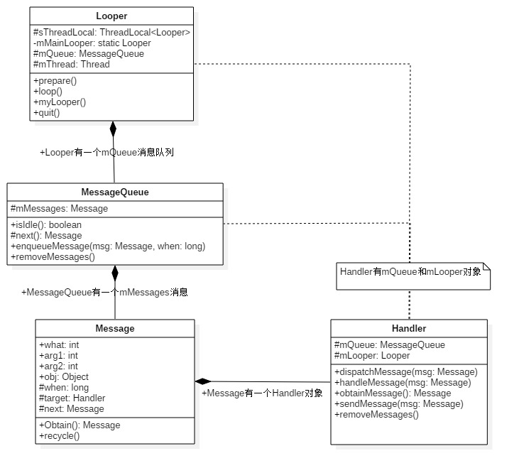

# 【一】消息机制

### 概述

> Android有大量的消息驱动方式来进行交互，比如Android的四剑客`Activity`, `Service`, `Broadcast`, `ContentProvider`的启动过程的交互，都离不开消息机制，Android某种意义上也可以说成是一个以消息驱动的系统。消息机制涉及MessageQueue/Message/Looper/Handler这4个类。

### 模型

消息机制主要包含：

- **Message**：消息分为硬件产生的消息(如按钮、触摸)和软件生成的消息；
- **MessageQueue**：消息队列的主要功能向消息池投递消息(`MessageQueue.enqueueMessage`)和取走消息池的消息(`MessageQueue.next`)；
- **Handler**：消息辅助类，主要功能向消息池发送各种消息事件(`Handler.sendMessage`)和处理相应消息事件(`Handler.handleMessage`)；
- **Looper**：不断循环执行(`Looper.loop`)，按分发机制将消息分发给目标处理者。

### 架构图



- **Looper**有一个MessageQueue消息队列；
- **MessageQueue**有一组待处理的Message；
- **Message**中有一个用于处理消息的Handler；
- **Handler**中有Looper和MessageQueue。

### 实例

```java
class LooperThread extends Thread {
    public Handler mHandler;

    public void run() {
        Looper.prepare();  

        mHandler = new Handler() { 
            public void handleMessage(Message msg) {
                //TODO 定义消息处理逻辑. 
            }
        };

        Looper.loop(); 
    }
}
```

### 消息机制


**图解：**

- Handler通过sendMessage()发送Message到MessageQueue队列；
- Looper通过loop()，不断提取出达到触发条件的Message，并将Message交给target来处理；
- 经过dispatchMessage()后，交回给Handler的handleMessage()来进行相应地处理。
- 将Message加入MessageQueue时，处往管道写入字符，可以会唤醒loop线程；如果MessageQueue中没有Message，并处于Idle状态，则会执行IdelHandler接口中的方法，往往用于做一些清理性地工作。

**消息分发的优先级：**

1. Message的回调方法：`message.callback.run()`，优先级最高；
2. Handler的回调方法：`Handler.mCallback.handleMessage(msg)`，优先级仅次于1；
3. Handler的默认方法：`Handler.handleMessage(msg)`，优先级最低。

**消息缓存：**

为了提供效率，提供了一个大小为50的Message缓存队列，减少对象不断创建与销毁的过程。