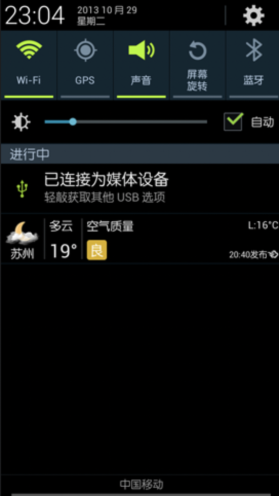
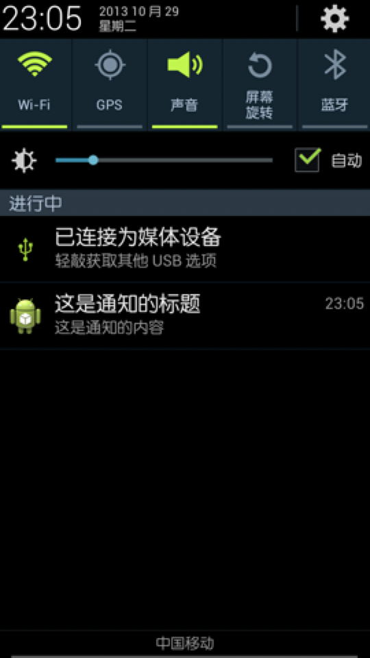

# 【四】前台Service

#### 什么是前台Service

> Service几乎都是在后台运行的，一直以来它都是默默地做着辛苦的工作。但是Service的系统优先级还是比较低的，当系统出现内存不足情况时，就有可能会回收掉正在后台运行的Service。如果你希望Service可以一直保持运行状态，而不会由于系统内存不足的原因导致被回收，就可以考虑使用前台Service。前台Service和普通Service最大的区别就在于，它会一直有一个正在运行的图标在系统的状态栏显示，下拉状态栏后可以看到更加详细的信息，非常类似于通知的效果。当然有时候你也可能不仅仅是为了防止Service被回收才使用前台Service，有些项目由于特殊的需求会要求必须使用前台Service，比如说墨迹天气，它的Service在后台更新天气数据的同时，还会在系统状态栏一直显示当前天气的信息，如下图所示：



#### 如何创建前台Service

> 首先创建了一个Notification对象，然后调用了它的setLatestEventInfo()方法来为通知初始化布局和数据，并在这里设置了点击通知后就打开MainActivity。然后调用 **startForeground()** 方法就可以让MyService变成一个前台Service，并会将通知的图片显示出来。

```java
public class MyService extends Service {
 
	public static final String TAG = "MyService";
 
	private MyBinder mBinder = new MyBinder();
 
	@Override
	public void onCreate() {
		super.onCreate();
		Notification notification = new Notification(R.drawable.ic_launcher,
				"有通知到来", System.currentTimeMillis());
		Intent notificationIntent = new Intent(this, MainActivity.class);
		PendingIntent pendingIntent = PendingIntent.getActivity(this, 0,
				notificationIntent, 0);
		notification.setLatestEventInfo(this, "这是通知的标题", "这是通知的内容",
				pendingIntent);
		startForeground(1, notification);
		Log.d(TAG, "onCreate() executed");
	}
 
	.........
```

> 现在重新运行一下程序，并点击Start Service或Bind Service按钮，MyService就会以前台Service的模式启动了，并且在系统状态栏会弹出一个通栏图标，下拉状态栏后可以看到通知的详细内容，如下图所示。



#### 注意

> 1. 在 Android O（8.0） 之前，创建前台服务的方式通常是先创建一个后台服务，然后将该服务推到前台。
>
> 2. 但对于 Android O，系统不允许后台应用创建后台服务。 因此，Android O 引入了一种全新的方法，即 
>
>    ContextCompat.startForegroundService()，以在前台启动新服务。 
>
> 3. 调用 ContextCompat.startForegroundService() **可以创建一个前台服务，相当于创建一个后台服务并将它推到前台**。
>
> 4. 创建一个用户可见的 Notification。
>
> 5. 必须立即（在5秒内）调用该服务的 startForeground(id: Int, notification: Notification) 方法，否则将停止服务并抛出 android.app.RemoteServiceException: Context.startForegroundService() did not then call Service.startForeground() 异常。