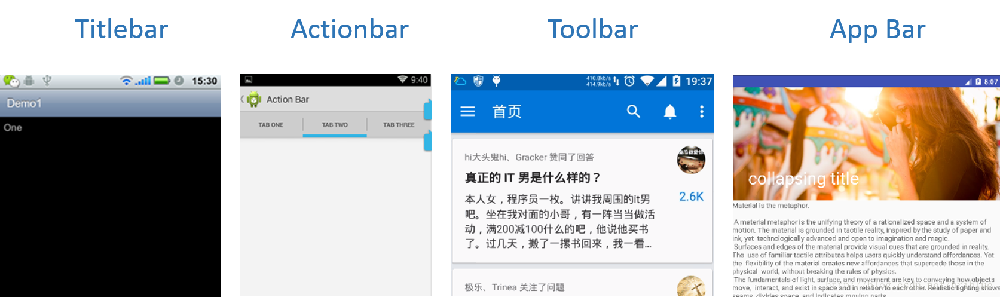

# DesignLayout

### 概述

Android Support Desgin 这个包中提供了一系列的组件如：CoordinatorLayout、AppBarLayout、FloatingActionButton 等等。其中 CoordinatorLayout 是核心，它是包内其它组件能够正常工作的前提。

1. CoordinatorLayout 是这个库的组织容器，一切基于 support design 扩展出来的特性都应该发生在 CoordinatorLayout 及它的子 View 体系中。

2. AppbarLayout 应该作为一个 CoordinatorLayout 的直接子 View，否则它与普通的 LinearLayout 无异。

3. AppbarLayout 的子 View 不仅仅是 Toolbar,它们可以是任何的 View，但通常和 Toolbar 配合使用。

###CoordinatorLayout

在 Android 为实现 Material Design 提供的支持包 android support design 中，CoordinatorLayout 毫无疑问是最核心的，它通过子 View 对象配置的 Behavior，实现了子 View 与 CoordinatorLayout、子 View 与子 View 之间一系列复杂的交互。

所以，CoordinatorLayout 编程的关键是它的子 View 们配置的 Behavior.

###AppBarLayout

AppBarLayout 本身有默认的 Behavior,这使得它能够响应依赖对象的位置变化或者是 CoordinatorLayout 中产生的嵌套滑动事件，而正是这个 Behavior，它会响应外部的嵌套滑动事件，然后根据特定的规则去伸缩和滑动内部的子 View。本文的主要目的就是要讲解这些特定的规则及它们作用后的效果。

AppBarLayout 本身想提供一个 AppBar 的概念，所以严格地讲它本身与 Toolbar 没有直接的关系。AppBarLayout 内部的子 View 不一定非要是 Toolbar,它可以是任何 View。

我们知道，Android 的历史进程中，大概有 TitleBar、ActionBar、Toolbar 的进化，这是 Android 设计语言的改良过程。而后来随着 Material Design 设计的出现,它又提供了 AppBar 的概念，而 AppBarLayout 则是 AppBar 在 Android 中的代码实现。 

AppBarLayout 虽然和 Toolbar 没有直接联系，但是当 Toolbar 内置在 AppbarLayout 中的时候，Toolbar 的效果增强了，这使得开发者非常愿意用 AppBarLayout 与 Toolbar 配合使用，这比单独使用 Toolbar 炫丽的多。所以，基本上有 AppBarLayout 的地方就有 Toolbar。通过 AppBarLayout 实现一个可伸缩折叠的 Toolbar 也是本文的目的。

### CollapsingToolbarLayout

CollapsingToolbarLayout 出现的目的只是为了增强 Toolbar。