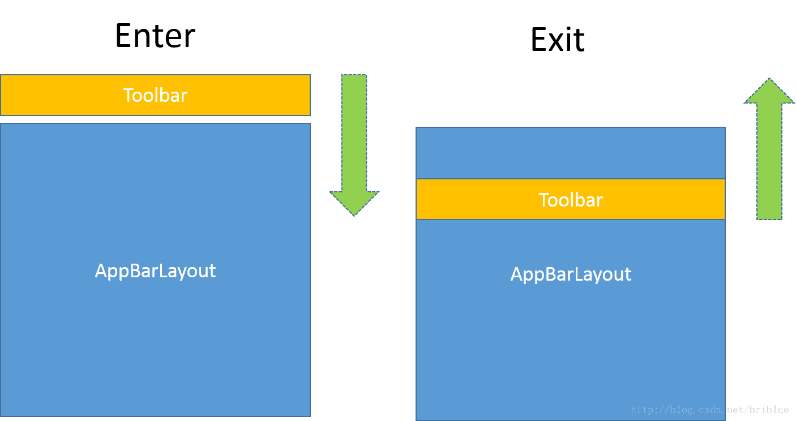
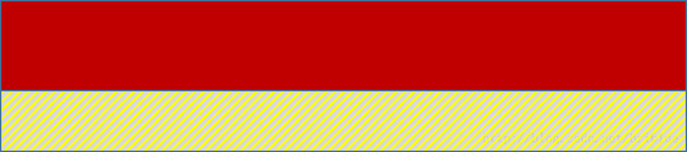

# AppBarLayout

### 概述

实际上我们在应用中有 CoordinatorLayout 的地方通常都会有 AppBarLayout 的联用，作为同样的出自 Design 包的库。一切效果都建立在 CoordinatorLayout 这个父类容器之上，AppBarLayout 要想正常发挥它的所有特性，那么它必须作为 CoordinatorLayout 的直接子类。

> * AppBarLayout 是一个垂直的 LinearLayout，实现了 Material Design 中 App bar 的 Scrolling Gestures 特性。AppBarLayout 的子 View 应该声明想要具有的“滚动行为”，这可以通过 layout_scrollFlags 属性或是 setScrollFlags() 方法来指定。
> * AppBarLayout 只有作为 CoordinatorLayout 的直接子 View 时才能正常工作，为了让 AppBarLayout 能够知道何时滚动其子 View，我们还应该在 CoordinatorLayout 布局中提供一个可滚动 View，我们称之为 Scrolling View。
> * Scrolling View 和 AppBarLayout 之间的关联，通过将 Scrolling View 的 Behavior 设为 AppBarLayout.ScrollingViewBehavior 来建立。
> * AppBarLayout 需要和一个独立的兄弟 View 配合使用，这个兄弟 View 是一个嵌套滑动组件，只有这样 AppBarLayout 才能知道什么时候开始滑动。它们之间关系的绑定通过给嵌套滑动的组件设立特定的 Behavior,那就是 AppBarLayout.ScrollingViewBehavior。

### 滑动视图

在 CoordinatorLayout 中嵌套滑动的本质是一个 NestedScrollingChild 对象。

NestedScrollingChild 是一个接口，目前它的实现类有 4个。 

1. NavigationMenuView
2. NestedScrollView
3. RecyclerView
4. SwipeRefreshLayout

### 示例

```xml
<?xml version="1.0" encoding="utf-8"?>
<androidx.coordinatorlayout.widget.CoordinatorLayout
        xmlns:android="http://schemas.android.com/apk/res/android"
        xmlns:tools="http://schemas.android.com/tools"
        xmlns:app="http://schemas.android.com/apk/res-auto"
        android:layout_width="match_parent"
        android:layout_height="match_parent"
        tools:context=".appbar.AppBarActivity">

    <com.google.android.material.appbar.AppBarLayout
            android:layout_width="match_parent"
            android:layout_height="wrap_content">

        <TextView android:layout_width="match_parent"
                  android:layout_height="wrap_content"
                  android:padding="15dp"
                  android:text="Header"
                  app:layout_scrollFlags="scroll|enterAlways"
        />

        <androidx.appcompat.widget.Toolbar
                android:id="@+id/toolbar"
                android:layout_width="match_parent"
                android:layout_height="?attr/actionBarSize"
                android:visibility="gone"
               />

    </com.google.android.material.appbar.AppBarLayout>

    <androidx.recyclerview.widget.RecyclerView
            android:id="@+id/recycler"
            android:layout_width="match_parent"
            android:layout_height="match_parent"
            app:layout_behavior="@string/appbar_scrolling_view_behavior"/>
</androidx.coordinatorlayout.widget.CoordinatorLayout>

```

由于要滑动，那么我们的 AppBarLayout 一定是和可以滑动的 View 一起使用的。

#### layout_scrollFlags

#### enter和exit的概念




当 AppBarLayout 中的内容要从 CoordinatorLayout 外面进入内部时，我们用 enter 指代这种行为，对应的手势就是向下滑动。

当 AppBarLayout 中的内容从 CoordinatorLayout 内部向外部方向移动时，我们用 exit 指代这种行为，对应的手势是向上滑动。

#### collapsed 折叠的概念



红框部分标明不能再被压缩的范围，其它部分都可以在滑动的过程中伸缩。

collapsed 的高度由相应的 View 的 minHeight 属性指定，也就是一个 View 的最小高度。

 #### layout_scrollFlags取值

- scroll（滑动）
  滑动是基础，后面的几个属性都是建立在此属性上的。滑动大家应该很好理解，只有在 AppBarLayout 中的子 View 配置了 scroll 属性，这个 AppBarLayout 都会响应。

  > scroll 这个 layout_scrollFlags 使得 Toolbar 像是 NestedScrollView 本身的一部分一样，它们同步响应滑动。
  >
  > 向上滑动的时候，Toolbar 先滑动，然后 NestedScrollView 中的内容再滑动。
  >
  > 向下滑动的时候，NestedScrollView 中的内容先滑动，然后 Toolbar 再一起滑动。

- exitUntilCollapsed
  exitUntilCollapsed 表示的是，向上滑动时，AppBarLayout 中设置了该属性的 View 可以滑动，等到这个 View 可视范围被压缩到 collapsed 指定的高度也就是 minHeight 时，这个 View 不再滑动。

  exitUntilCollapsed 的存在，让 scroll 滑动受到了一定的限制。这个限制就是 scoll 不再能够进行完全的滑动，因为 collapsed 距离的存在。

- enterAlways
  当 Scrolling view 向下滚动时，本 View 会一起跟着向下滚动。实际上就好比我们同时对 Scrolling view 和本 View 进行向下滚动。

- enterAlwaysCollapsed
  从名字上就可以看出，这是在 `enterAlways`的基础上，加上了“折叠”的效果。当我们开始向下滚动 Scrolling View 时，本 View 会一起跟着滚动直到达到其“折叠高度”（即最小高度）。然后当 Scrolling View 滚动至顶部内容完全显示后，再向下滚动 Scrolling View，本 View 会继续滚动到完全显示出来。

- snap
  snap 代表一种吸附的行为，当一个滑动事件结束后，Toolbar 会向最接近它的边缘自行滚动。那什么是最近的概念呢？比如向上滑动时，如果滑过了一半它就向上滚动，否则滚动回原来的地方


行为可以自由搭配，比如定制一个 enter 时 enterAlwaysCollapsed，exit 时 exitUntilCollapsed 的行为。

比如定制一个enter和exit

```xml
app:layout_scrollFlags="scroll|enterAlways|enterAlwaysCollapsed|exitUntilCollapsed" 
```

