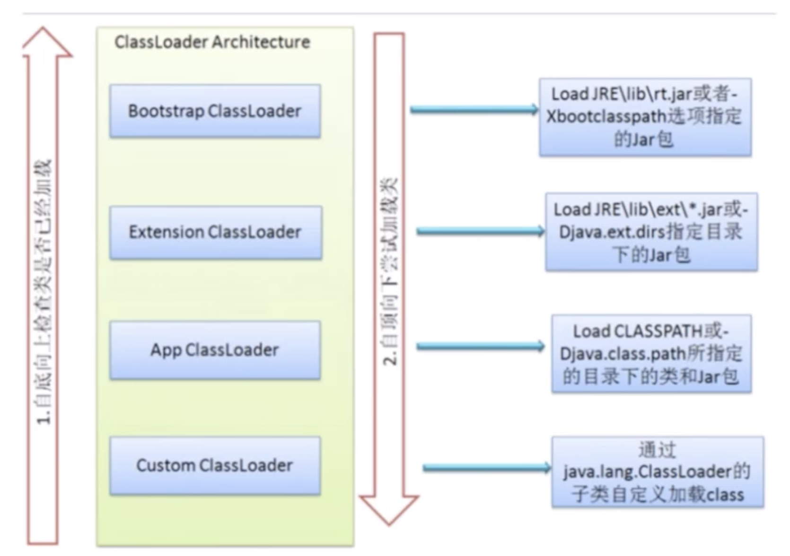
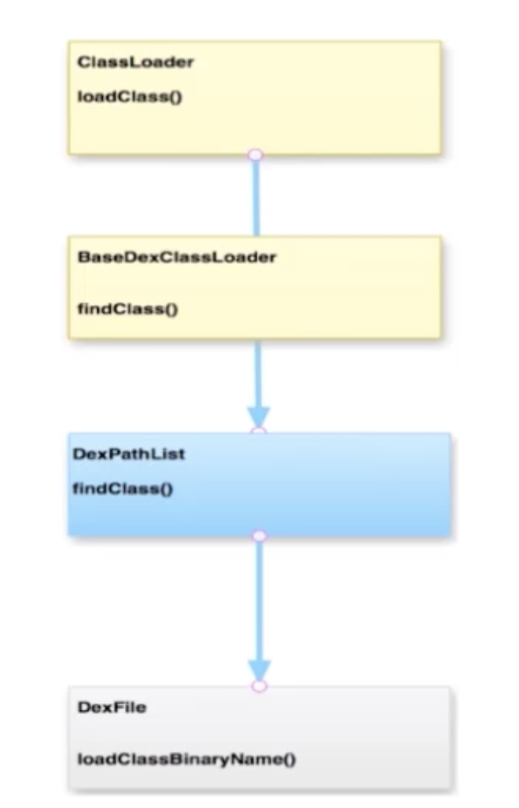

# 【四】ClassLoader

### Java中的ClassLoader



### Android中的ClassLoader(https://blog.csdn.net/colinandroid/article/details/80712045)


#### 分类

* **BootClassLoader**

  > 类似Java的BootStrap ClassLoader，用于加载Android Framework层class文件。

* **PathClassLoader**

  > 类似Java的App ClassLoader，用于加载已经安装到系统中的apk中的class文件。

* **DexClassLoader**

  > 类似Java的Custom ClassLoader，用于加载指定目录中的class文件。

* **BaseDexClassLoader**

  > PathClassLoader和DexClassLoader的父类

#### 特点及作用

* 双亲代理模式

  > ClassLoader在加载一个class文件时：会询问当前ClassLoader是否已经加载过子类，如果已经加载过则直接返回，不再重复加载。如果没有加载过，会去查询当前ClassLoader的parent是否已经加载过。

* 类加载的共享功能

  > 当一个class文件被任何一个ClassLoader加载过，就不会再被其他ClassLoader加载。

* 类加载的隔离功能

  > 不同ClassLoader加载的class文件肯定不是一个。举个栗子，一些系统层级的class文件在系统初始化的时候被加载，比如java.net.String，这个是在应用启动前就被系统加载好的。如果在一个应用里能简单地用一个自定义的String类把这个String类替换掉的话，将有严重的安全问题。

```java
protected Class<?> loadClass(String name, boolean resolve)
        throws ClassNotFoundException
    {
            // First, check if the class has already been loaded
            Class c = findLoadedClass(name);
            if (c == null) {
                long t0 = System.nanoTime();
                try {
                    if (parent != null) {
                        c = parent.loadClass(name, false);
                    } else {
                        c = findBootstrapClassOrNull(name);
                    }
                } catch (ClassNotFoundException e) {
                    // ClassNotFoundException thrown if class not found
                    // from the non-null parent class loader
                }

                if (c == null) {
                    // If still not found, then invoke findClass in order
                    // to find the class.
                    long t1 = System.nanoTime();
                    c = findClass(name);

                    // this is the defining class loader; record the stats
                }
            }
            return c;
    }

```

### DexClassLoader

```java
public class DexClassLoader extends BaseDexClassLoader {

    public DexClassLoader(String dexPath, String optimizedDirectory,
            String libraryPath, ClassLoader parent) {
        super(dexPath, new File(optimizedDirectory), libraryPath, parent);
    }
}
```

可以看到DexClassLoader的源码非常简单，只有一个构造方法。我们来看下其四个参数都是什么含义。

dexPath。要加载的dex文件路径。
optimizedDirectory。dex文件要被copy到的目录路径。
libraryPath。apk文件中类要使用的c/c++代码。
parent。父装载器，也就是真正loadclass的装载器。

### PathClassLoader

```java
public class PathClassLoader extends BaseDexClassLoader {
 
    public PathClassLoader(String dexPath, ClassLoader parent) {
        super(dexPath, null, null, parent);
    }

 
    public PathClassLoader(String dexPath, String libraryPath,
            ClassLoader parent) {
        super(dexPath, null, libraryPath, parent);
    }
}

```

它的源码也只是有两个构造方法，我们来看第二个构造方法，可以看出，它与DexClassLoader的构造方法的区别就是少了一个要把dex文件copy到的目录路径。正是因为缺少这个路径，我们的PathClassLoader只能用来加载安装过的apk中的dex文件。

### BaseDexClassLoader

```java
public class BaseDexClassLoader extends ClassLoader {
    private final DexPathList pathList;

    public BaseDexClassLoader(String dexPath, File optimizedDirectory,
            String librarySearchPath, ClassLoader parent) {
        super(parent);
        this.pathList = new DexPathList(this, dexPath, librarySearchPath, optimizedDirectory);
    }

    @Override
    protected Class<?> findClass(String name) throws ClassNotFoundException {
        List<Throwable> suppressedExceptions = new ArrayList<Throwable>();
        Class c = pathList.findClass(name, suppressedExceptions);
        if (c == null) {
            ClassNotFoundException cnfe = new ClassNotFoundException("Didn't find class \"" + name + "\" on path: " + pathList);
           for (Throwable t : suppressedExceptions) {
                cnfe.addSuppressed(t);
            }
            throw cnfe;
        }
        return c;
    }
    /**
     * @hide
     */
    public void addDexPath(String dexPath) {
        pathList.addDexPath(dexPath, null /*optimizedDirectory*/);
    }

    @Override
    protected URL findResource(String name) {
        return pathList.findResource(name);
    }

    @Override
    protected Enumeration<URL> findResources(String name) {
        return pathList.findResources(name);
    }

    @Override
    public String findLibrary(String name) {
        return pathList.findLibrary(name);
    }


    protected synchronized Package getPackage(String name) {
        if (name != null && !name.isEmpty()) {
            Package pack = super.getPackage(name);

            if (pack == null) {
                pack = definePackage(name, "Unknown", "0.0", "Unknown",
                        "Unknown", "0.0", "Unknown", null);
            }

            return pack;
        }

        return null;
    }

    /**
     * @hide
     */
    public String getLdLibraryPath() {
        StringBuilder result = new StringBuilder();
        for (File directory : pathList.getNativeLibraryDirectories()) {
            if (result.length() > 0) {
                result.append(':');
            }
            result.append(directory);
        }

        return result.toString();
    }

    @Override public String toString() {
        return getClass().getName() + "[" + pathList + "]";
    }
}

```



### 动态加载难点

* 有许多组件类需要注册才能使用；
* 资源的动态加载很复杂；
* Android程序运行需要上下文环境；