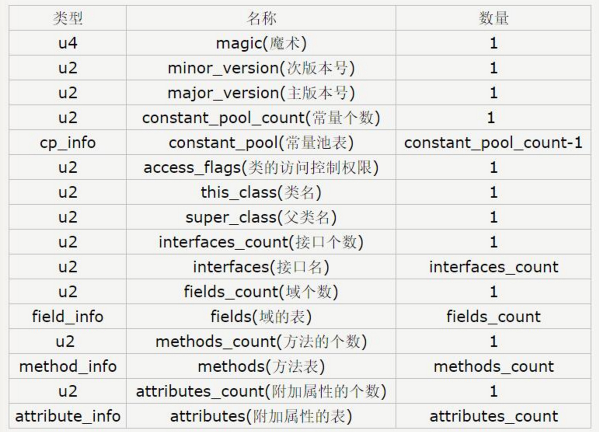

# 【二】class文件

### 概念

* 能够被JVM识别，加载并执行的文件格式；
* 记录一个类文件的所有信息；

### 生成class文件

* 通过IDE自动帮我们build；
* 手动通过javac去生成class文件；
* 通过java命令去执行class文件；

### class文件结构

* 一种8位字节的二进制流文件；
* 各个数据按顺序紧密的排列，无间隙；
* 每个类或接口都单独占据一个class文件；

### class文件弊端

* 内存占用大，不适合移动端；
* 堆栈加载模式，加载速度慢；
* 文件IO操作多，类查找慢；