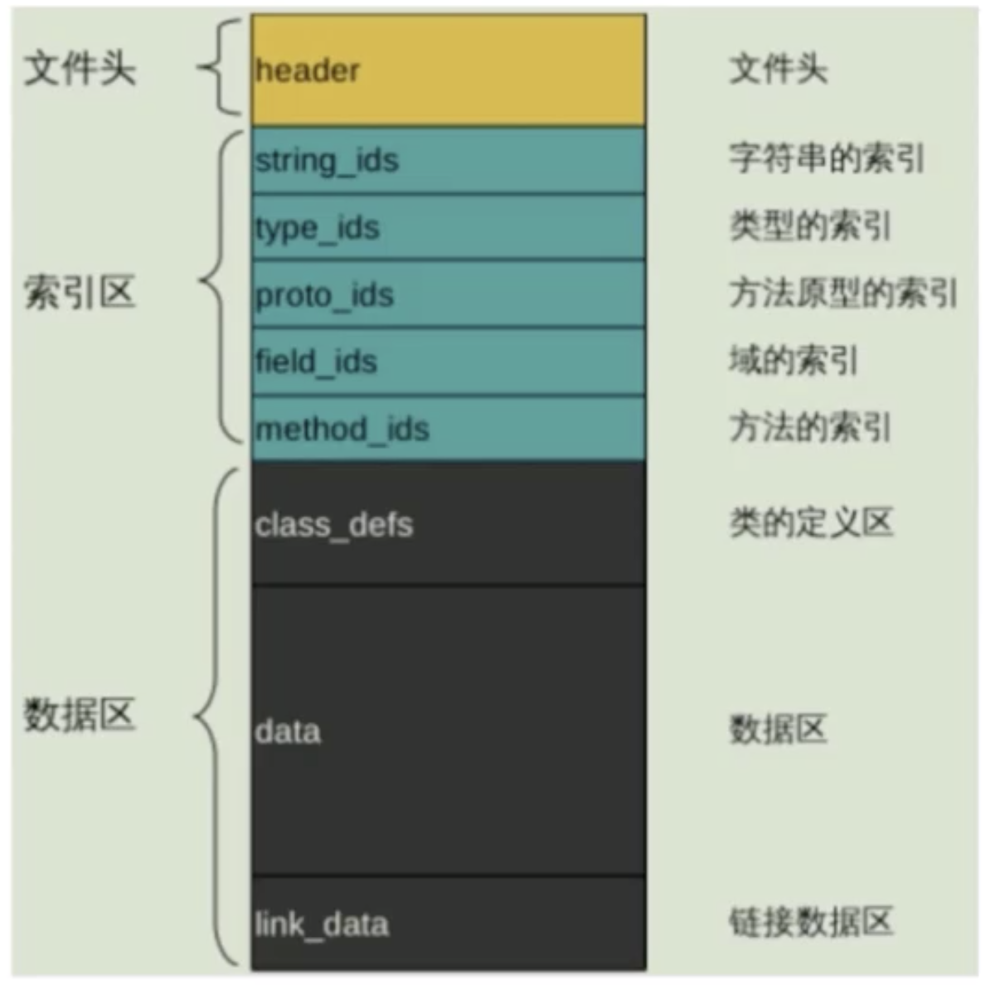

# 【三】dex文件

### 概念

* 能够被DVM识别，加载并执行的文件格式；
* 记录整个工程中所有类文件的信息

### 生成dex文件

* 通过IDE自动生成dex文件；
* 手动通过dx命令去生成dex文件；

```shell
#dx工具位于sdk->build-tools下，通过class文件生成dex文件
dx --dex --output xxx.dex xxx.class
```

* 执行dex文件

```shell
#将dex文件push到手机
adb push xxx.dex /storage/emulated/0

#进入adb shell
adb shell

#执行dex,需要使用类名xxx
dalvikvm -cp /sdcard/xxx.dex xxx
```

### dex文件结构

- 一种8位字节的二进制流文件；
- 各个数据按顺序紧密的排列，无间隙；
- 整个应用中所有Java源文件都放在一个dex中；

