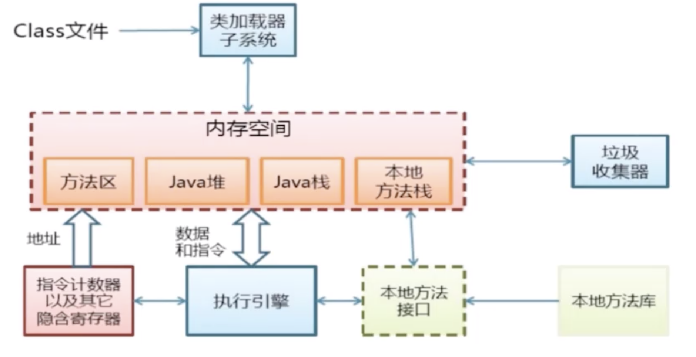
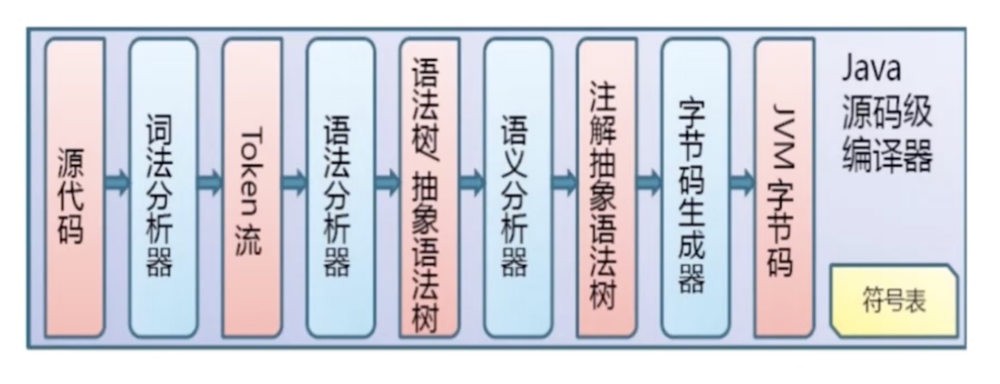
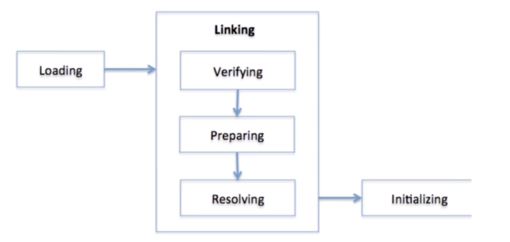
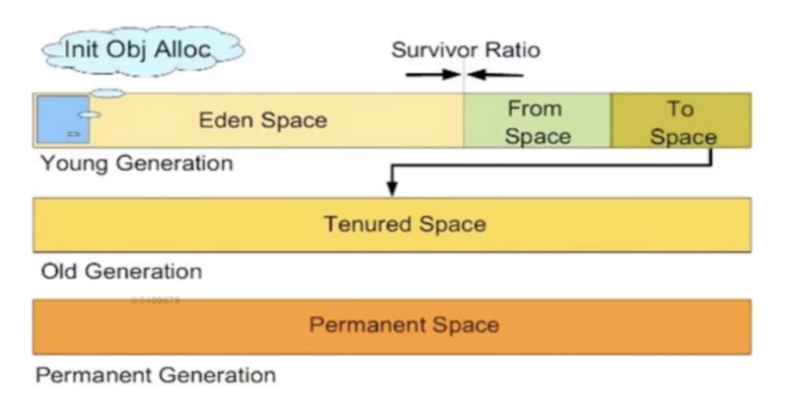
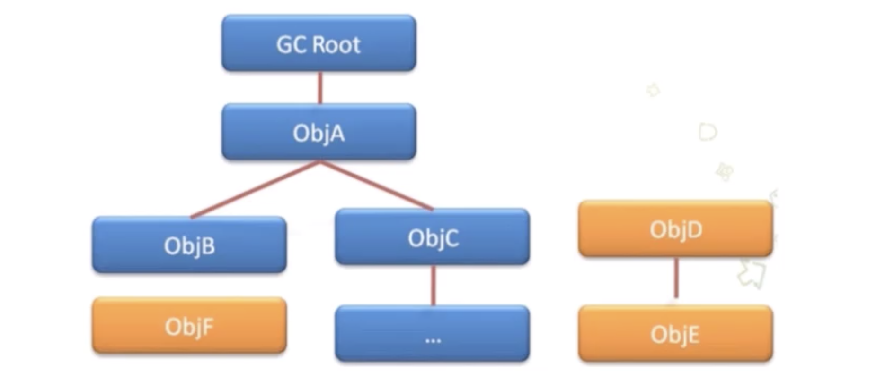
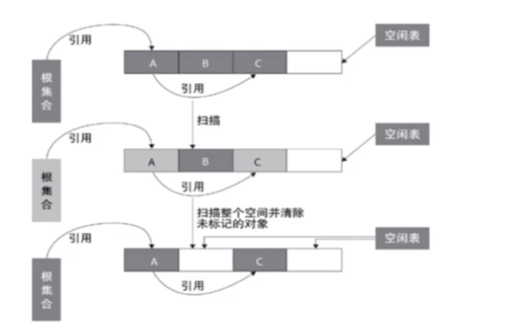
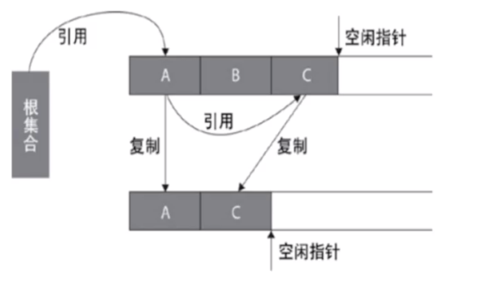
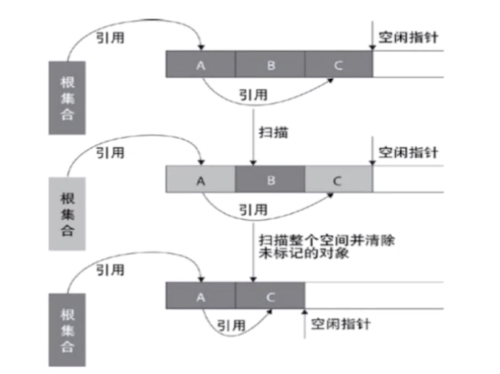

【一】虚拟机详解

### JVM结构

### 编译流程

### 类加载器

### 加载流程

* **Loading**：类的信息从文件中获取并且载入到JVM的内存里；
* **Verifying**：检查读入的结构是否符合JVM规范的描述；
* **Preparing**：分配一个结构用来存储类信息；
* **Resolving**：把这个类的常量池中的所有的符号引用改变成直接引用；
* **Initializing**：执行静态初始化程序，把静态变量初始化成指定的值；

### JVM内存管理

#### Java栈区

* 它存放的是Java方法执行时的所有的数据；

* 由栈帧组成，一个栈帧代表一个方法的执行；

  > 每个方法从调用到执行完成就对应一个栈帧在虚拟机栈中入栈到出栈；
  >
  > 包括局部变量表、栈操作数、动态链接、方法出口；

#### 本地方法栈

类似于Java栈区，本地方法栈专门为native方法服务。

#### 方法区

存储被虚拟机加载的类信息、常量、静态变量、即时编译器编译后等数据

#### 堆区

* 所有通过new创建的对象的内存都在堆中分配 ；
* 虚拟机中最大的一块内存，是GC要回收的部分；

堆区内存分布：

### 垃圾回收

#### 垃圾收集算法

* **引用记数算法**

* **可达性算法**

  

#### 垃圾回收算法

* **标记-清除算法**

  

* **复制算法**

  

* **标记-整理算法**

  

#### 触发回收条件

* Java虚拟机无法再为新的对象分配内存空间了；
* 手动调用System.gc()方法**(强烈不推荐)**
* 低优先级的GC线程，被运行时就会执行GC

### Dalvik VM vs JVM

* 执行文件不同，一个是dex，一个是class;
* 类加载系统区别较大；
* DVM可同时存在多个，JVM只会有一个；
* DVM是基于寄存器的，JVM是基于栈的；

### ART虚拟机

* DVM使用JIT来将字节码转换成机器码，效率低；

* ART采用了AOT预编译技术，执行速度更快；

  > AOT在应用程序安装时，就把字节码转换成了本地机器码，会占用更多的应用安装时间和内存，以空间换时间。